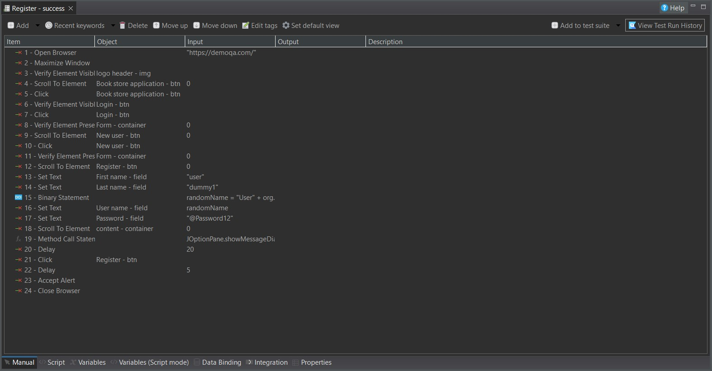
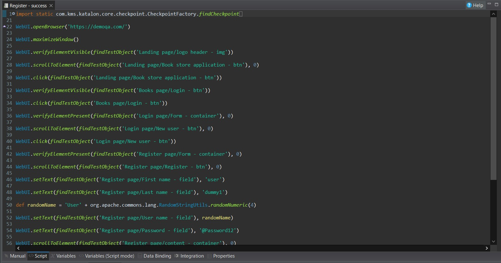
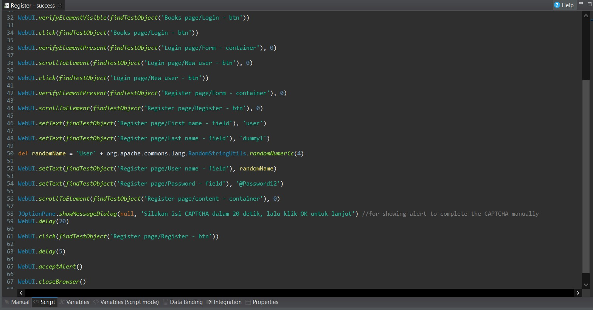
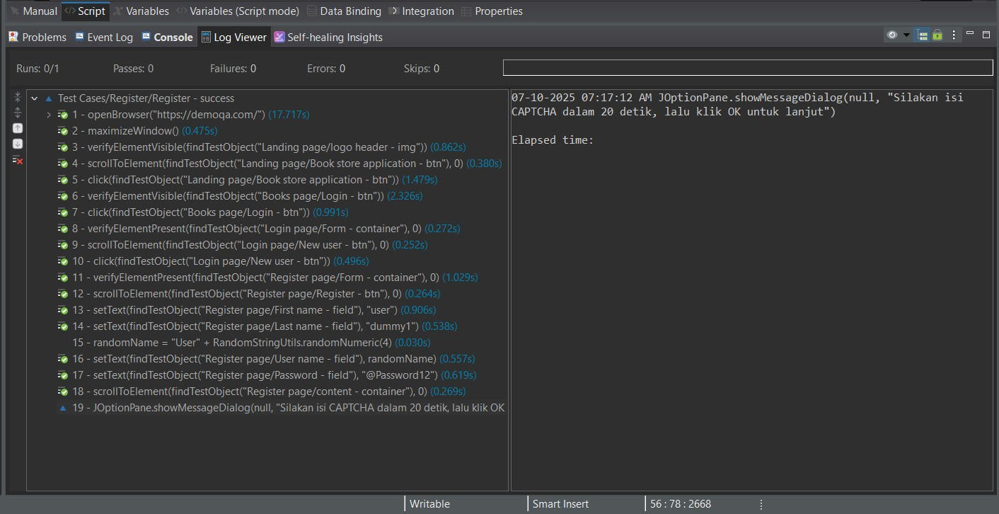

# 🧪 UI Automation Testing with Katalon Studio

This project contains UI automated test cases developed using **Katalon Studio** as part of my final project at After Office Academy.  
The test cases cover common web functionalities using the public testing site [DemoQA](https://demoqa.com/).

---

## 📌 Features Tested

- ✅ Form Input Validation
- ✅ Button Clicks & Navigation
- ✅ Alert and Modal Handling
- ✅ Text Assertions
- ✅ Element Visibility & Interaction
- ✅ Test Case & Test Suites Execution

---

## 🧰 Tech Stack

- [Katalon Studio](https://katalon.com/)
- Groovy
- Test Suites & Test Cases
- Git (for version control)

---

## 📁 Project Structure
📂 Test Cases
📂 Test Suites
📂 Object Repository
📂 Profiles
📂 Scripts
📄 .gitignore
📄 README.md

---

## 📸 Sample Screenshots

### 🧪 Test Script in Katalon

### ✅ Test Execution Result

---

## 🙋‍♂️ Author

**Muhammad Hafidh Sanjaya**  
Software QA Engineer  
📫 [GitHub](https://github.com/hafidhsanjayaa) • [LinkedIn](https://linkedin.com/in/hafidhsanjaya) • 📧 hafidhsanjaya2@gmail.com

